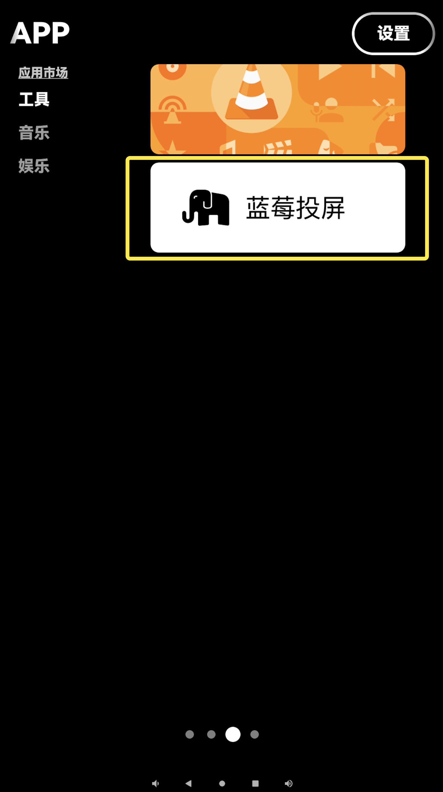
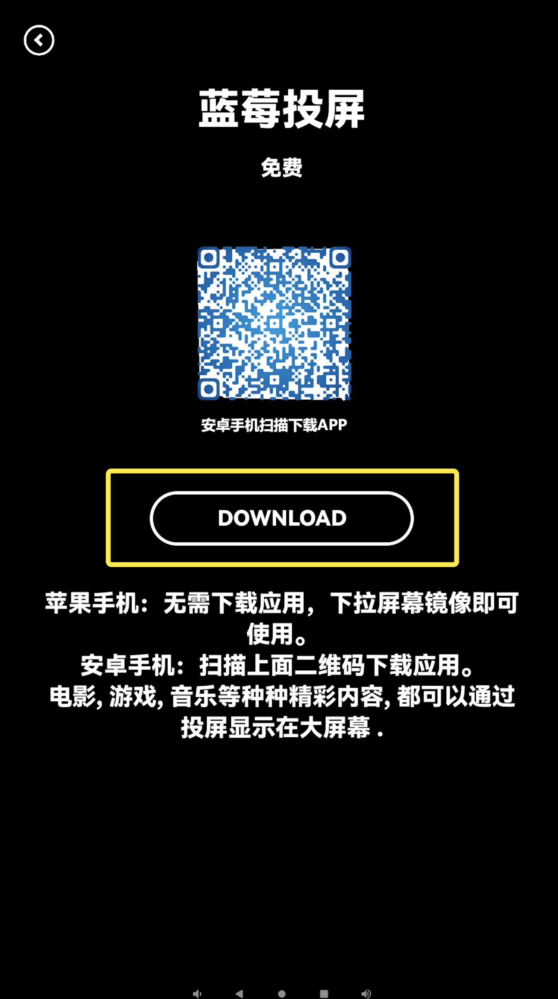
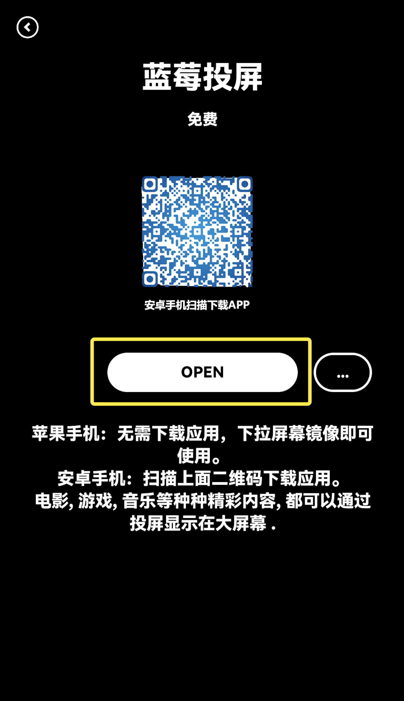
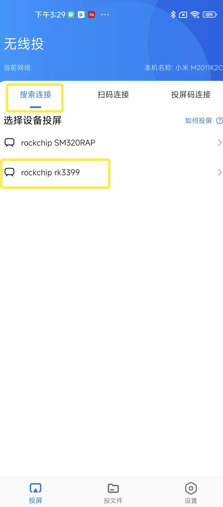
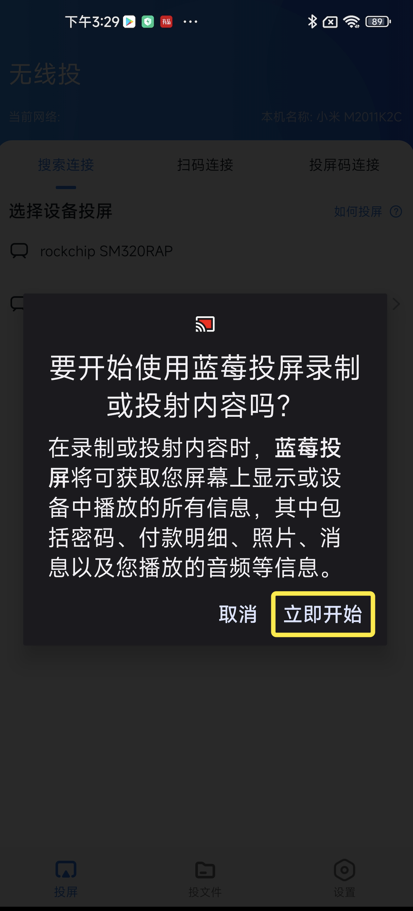
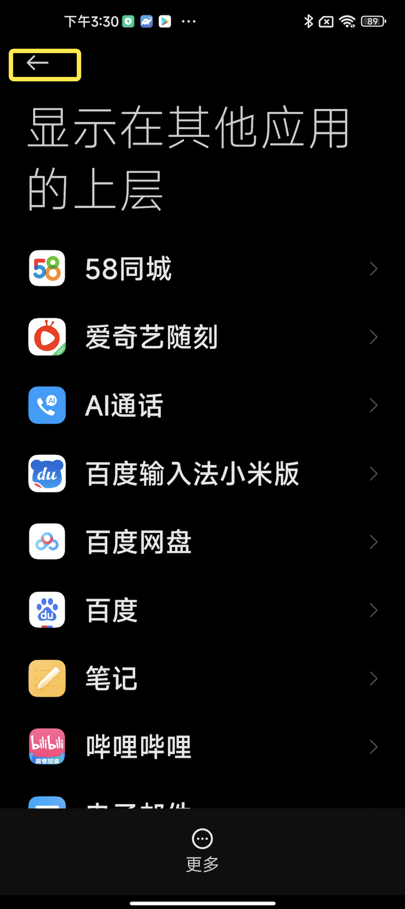
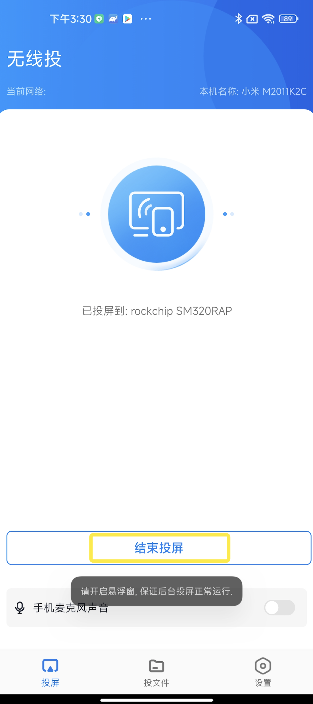

## Android携帯電話は携帯電話の画面ミラーリングを使用します

1、サード スクリーン アプリのページを開き、[ツール] をクリックし、[Blueberry Screencast] をクリックします。

2、ダウンロードをクリックして「Blueberry Screencast」をダウンロードします

3、下のQRコードを携帯電話でスキャンして、「Blueberry Mirroring」アプリをダウンロードしてください。 「開く」をクリックして「Blueberry Mirroring」を開きます

4、携帯電話で「Blueberry Screencast」アプリを開き、ミラーに一致するデバイス名を検索します。 「スキャンコード接続」「スクリーンコード接続」をクリックして接続することもできます

5、「OPEN」をクリック

6、戻るボタンをクリックして、モバイル画面のミラーリングを実現します

7、「Blueberry Screencasting」をクリックし、「End Screencasting」をクリックすると、スクリーンキャスティングが終了します。

