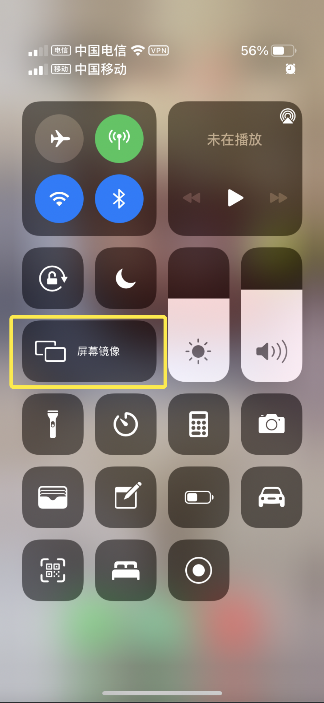
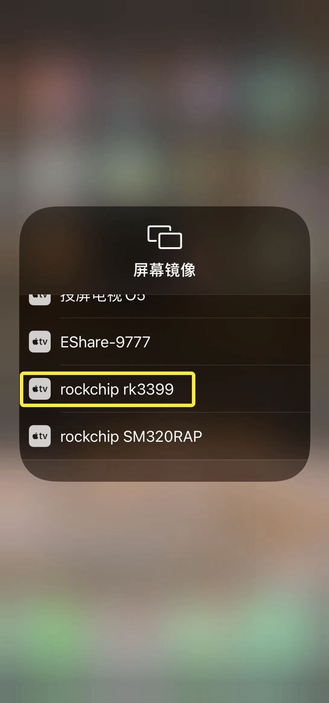
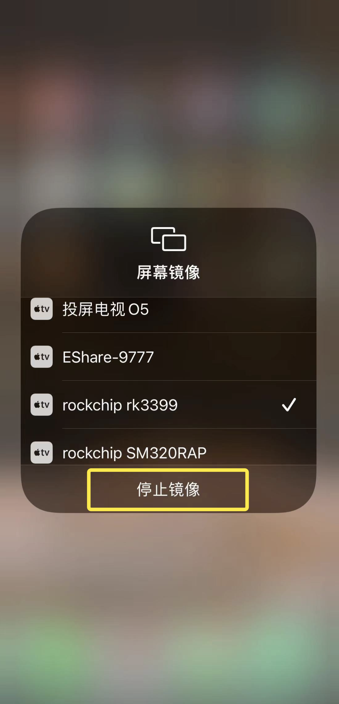

## Apple IOS ミラーリング

1、サード スクリーン アプリのページを開き、[ツール] をクリックし、[Blueberry Screencast] をクリックします。

2、ダウンロードをクリックして「Blueberry Screencast」をダウンロードします

3、「開く」をクリックして「Blueberry Mirroring」を開きます

4、次の画面が表示されます

5、Apple 携帯電話: 携帯電話の右上隅にあるドロップダウン メニューで、[画面のミラーリング] をクリックし、ミラーに一致するデバイス名を選択すると、画面のミラーリングが成功します。 電話の右上隅にあるメニューをプルダウンし、[ミラーリングの停止] をクリックすると、電話の画面ミラーリングが終了します。

