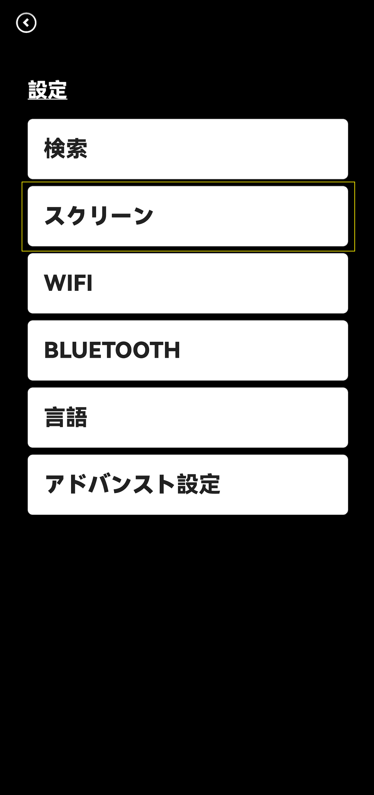
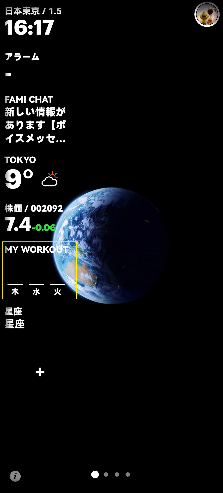
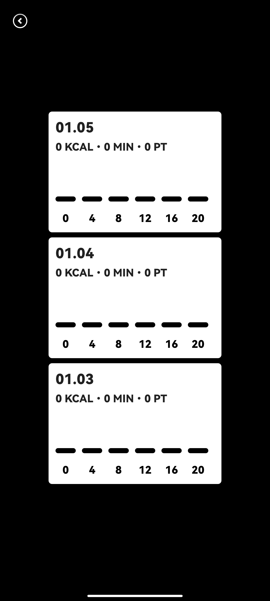
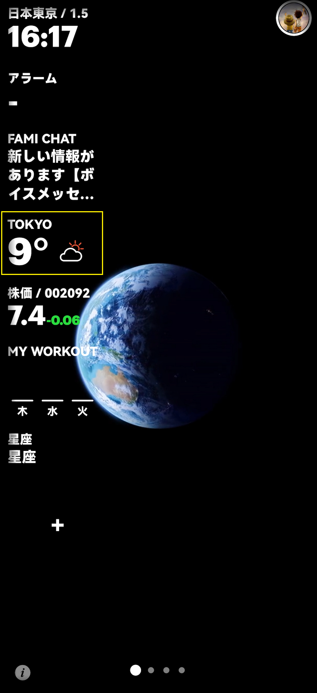
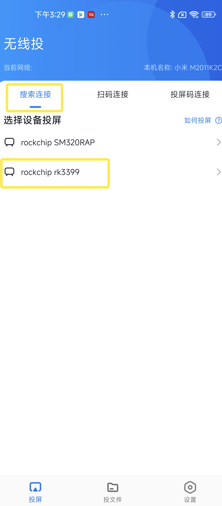
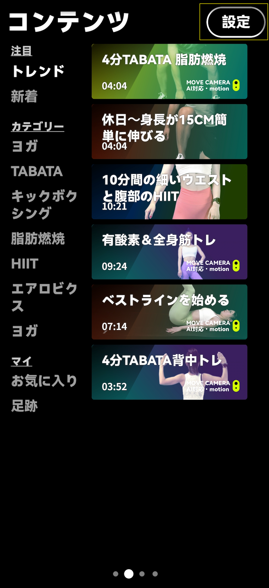
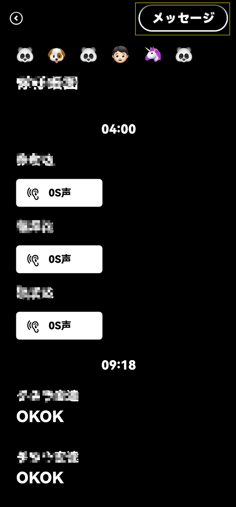
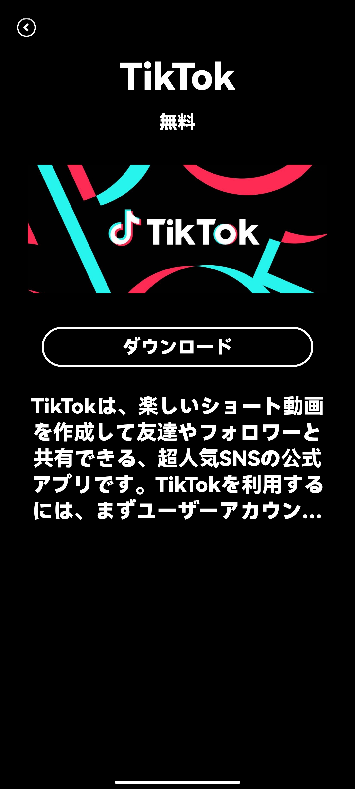

# 天気を追加

1.  ホームページのミニアプリ「天気」をクリック
    

2.  「NEW」をクリック
    

3.  都市名を入力して「OK」をクリック

4.  「都市名」をクリック
    

5.  「YES」をクリック
    

6.  戻るをクリックして都市の天気を追加完成

# タイマー付きスリープ、画面の明るさの設定

1.ホームページを右から左にスワイプして2ページ目、「設定」をクリック

2.「壁紙」をクリック

3.設定ページに入ったら、「スリープ」と「明るさ」の設定を入力します。

# BLUETOOTHを追加

> [!tip](Bluetooth 4.2 以下のデバイスのみをサポートします)

1.ホームページを右から左にスワイプして2ページ目、「設定」をクリック

2.「Bluetooth」をクリックして「オン」を選択。

3.接続するデバイスを選択すると、Bluetooth 接続を実現できます。

# 家族の追加/削除

1.ホームページの右上隅にあるアバターをクリックします

2.右上の「NEW」をクリック

3.新しく登録した携帯電話番号を入力し、SMS認証を送信します。 認証が成功すると、家族の追加が完了します。

4.长ログアウトする必要がある家族のアバターを長押しし、[削除] をクリックして家族からログアウトします。

## Apple IOS ミラーリング

1、サード スクリーン アプリのページを開き、[ツール] をクリックし、[Blueberry Screencast] をクリックします。

2、ダウンロードをクリックして「Blueberry Screencast」をダウンロードします

3、「開く」をクリックして「Blueberry Mirroring」を開きます

4、次の画面が表示されます

5、Apple 携帯電話: 携帯電話の右上隅にあるドロップダウン メニューで、[画面のミラーリング] をクリックし、ミラーに一致するデバイス名を選択すると、画面のミラーリングが成功します。 電話の右上隅にあるメニューをプルダウンし、[ミラーリングの停止] をクリックすると、電話の画面ミラーリングが終了します。

# 株価を削除

1.ホームページのミニアプリ「株価」をクリック

2.株価ページに入ったら、削除したい株式情報を長押しし、「削除」をクリックすると株価が削除されます。

# 運動履歴を見る

ホームページミニアプリの「運動記録」をクリックしてご覧ください。

過去3日間の運動記録

週間運動記録

月間運動記録

# 登録; ログイン

## 1.登録会員
1.ログイン インターフェイスに移動するときは、携帯電話番号を入力して確認コードを取得し、正しい確認コードを入力してログインします。

## 2.ログインシステム
1.ホームページでLannoにログインすると、システムはメンバーとして登録し、アバター（アバターはモバイルAPPを使用して変更できます）と個人情報（個人設定はいつでも変更できます）を選択します。

>[!tip]現在、アメリカ、日本、中国でのユーザー登録を仮受付中

2.ログイン後、Lannoは通常通りご利用いただけます。

## 3.モバイルアプリのダウンロード

1.アプリ ストアで [lanno] を検索してダウンロードします。

# アラームを削除

1.  MINI APP「アラーム」をクリック。
        

2.  目覚まし時計のページに入ったら、削除・修正したい目覚まし時計を長押しし、「削除」または「修正」をクリックします。
    

# フィットネス クラスの開始/終了

1.最初のページで画面を右から左にスワイプすると、2 ページ目に移動します。 必要なコースを選択し、コース名をクリックしてください。

2.「PLAY」をクリックして、コーストレーニングに入ります。

3.右上隅の「❎」をクリックし、「OK」をクリックしてコースを終了します。

# 天気予報を削除する

1.  MINI APPの天気をクリックします。
    

2.  「TOKYO」などの地域を長押しします。

    
3.  「削除」をクリックし、「戻る」をクリックして地域の天気予報を削除します。

# タイムゾーン設定

1.MINIAPPホームページの「時間」をクリック

2.変更が必要なタイムゾーンをクリックします（現在、日本、韓国、中国、シンガポール、および米国のみが追加されています）

3.左上隅をクリックして戻ります。

## Android携帯電話は携帯電話の画面ミラーリングを使用します

1、サード スクリーン アプリのページを開き、[ツール] をクリックし、[Blueberry Screencast] をクリックします。

2、ダウンロードをクリックして「Blueberry Screencast」をダウンロードします

3、下のQRコードを携帯電話でスキャンして、「Blueberry Mirroring」アプリをダウンロードしてください。 「開く」をクリックして「Blueberry Mirroring」を開きます

4、携帯電話で「Blueberry Screencast」アプリを開き、ミラーに一致するデバイス名を検索します。 「スキャンコード接続」「スクリーンコード接続」をクリックして接続することもできます

5、「OPEN」をクリック

6、戻るボタンをクリックして、モバイル画面のミラーリングを実現します

7、「Blueberry Screencasting」をクリックし、「End Screencasting」をクリックすると、スクリーンキャスティングが終了します。

[markdown](../jp/register_login.md ':include width=100%')

# ファームウェアの更新

>[!tip]ファームウェアのリリース後にシステムがネットワークに接続されると自動的に更新され、手動操作は必要ありません。

>[!tip]发布固件后系统联网后自动更新，不需要手动操作。

>[!tip]After the firmware is released, the system will be automatically updated after networking, without manual operation.

# ホームの壁紙設定

1.右上隅の「設定」をクリックします

2.「壁紙」をクリック

3.入力後、もう一度「壁紙」をクリックし、好きな壁紙を選んでクリック。

4.  右上隅の「OK」をクリックして、壁紙の変更を実現します。

# 株価MINI APPを追加

1.ホームページのミニアプリ「株価」をクリック

2.右上隅の「プラス記号」をクリックし、表示したい証券コードを入力して「OK」をクリックします

3.選び株価をクリック

4.  「OK」をクリックして、在庫情報の追加を完了します。

# アラームを追加

1.  ミニアプリ「アラーム」をクリック

2.  右上隅の「プラス記号」をクリックし、白いバーで時間を選択します。 右下隅の「確認」をクリックし、「OK」ボタンをクリックして目覚まし時計を追加します。
    

# 家族グループ メッセージ

1.ホームページのミニアプリ「ファミリーチャット」をクリック

2.「メッセージ」をクリック

3.メッセージを入力して「OK」をクリックすると、ファミリー グループ チャット メッセージが表示されます。

# MINI APPアプリケーションの表示/非表示

1.画面の「プラス記号」をタップ

2.画面のミニアプリ（「時間」「アラーム」「株価」「ファミチャット」「天気」「スポーツ記録」など）を1回タップするとグレーアウトし、ミニのホームページが表示されますアプリが非表示になりますので、ミニアプリをもう一度タップすると、ミニアプリのホームページに表示されるホワイトが表示されます。

ページのミニアプリの並べ替え: すべてのミニアプリ (「タイムゾーン」、「目覚まし時計」など) をタップし、すべてのミニアプリがグレー表示になったら、達成したいミニアプリの順序に従って 1 つずつクリックします。

# APP STORE

1.ホームページを右から左に 2 回スワイプすると、3 ページ目に移動します。

2.気になるアプリを選択し、[TIKTOK] をクリックしてアプリをダウンロードします。

3.ダウンロード後、「OPEN」をクリックしてサードパーティ製アプリの使用を開始します。

# 当社について

## お問い合わせ
ご提案やご質問がございましたら、ページのlannoのコメント、またはWeChat公式アカウントのカスタマーサービスのフィードバックからタイムリーなフィードバックをお寄せください. また、Lannoご利用時の【よくあるご質問】[よくある質問](/jp/README.md)についても整理しておりますので、WeChat公式アカウントまでご連絡いただくか、問題の優先度順に対応させていただきます。

## LINE ACOUNT

> **Lanno** をお選びいただきありがとうございます。Lanno の機能とユーザー エクスペリエンスの向上に努めてまいります。
> ^\_^

# APP STOREの アプリケーションを削除する

1.削除したいアプリを開き、SPOTIFY を例に取り、アプリのホームページの“...”をクリックします。

2.[削除] をクリックします。

3.ダウンロード（DOWNLOAD）ボタンが表示されれば、正常に削除されたことを意味します。

