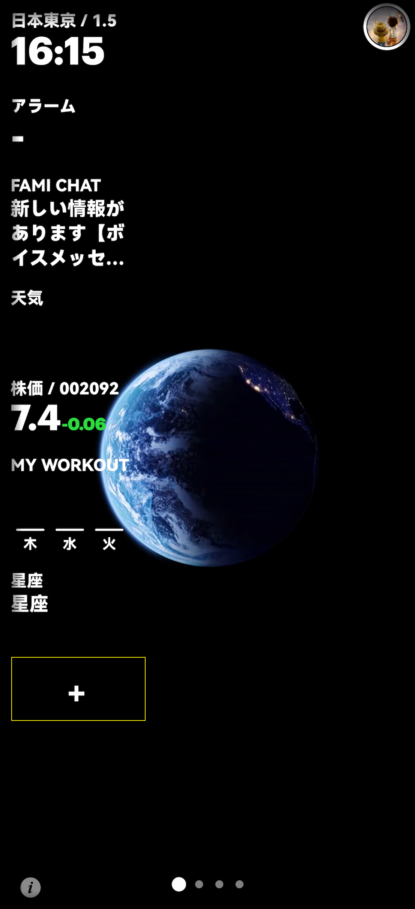

# MINI APPアプリケーションの表示/非表示

1.画面の「プラス記号」をタップ

2.画面のミニアプリ（「時間」「アラーム」「株価」「ファミチャット」「天気」「スポーツ記録」など）を1回タップするとグレーアウトし、ミニのホームページが表示されますアプリが非表示になりますので、ミニアプリをもう一度タップすると、ミニアプリのホームページに表示されるホワイトが表示されます。

ページのミニアプリの並べ替え: すべてのミニアプリ (「タイムゾーン」、「目覚まし時計」など) をタップし、すべてのミニアプリがグレー表示になったら、達成したいミニアプリの順序に従って 1 つずつクリックします。